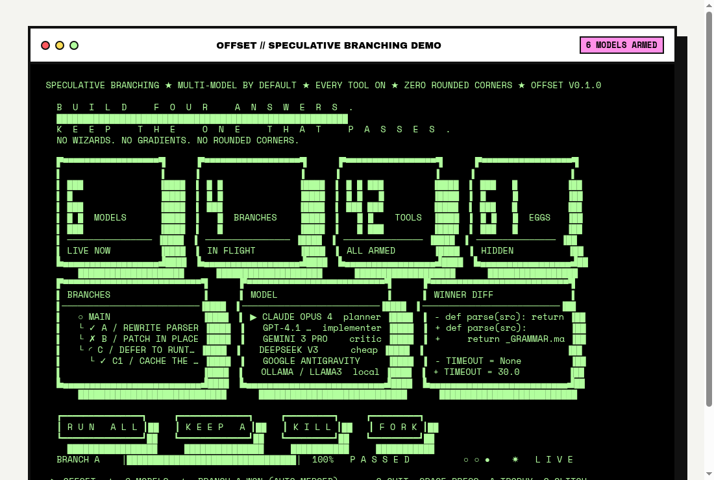

# OFFSET

<div align="center">

```
   ▄▄▄     ▄▄▄   
  ████▄▄▄▄▄████  
 ██████████████   OFFSET // TERMINAL CODING AGENT
 ██ ██████ ██    SPECULATIVE BRANCHING
 █████ ██ █████  
 ██████████████  
  ████████████   
```

[](https://the-masked-bear.github.io/offset-terminal/)
[](https://debarghya47.gumroad.com/l/qzqnxk)

<br>

[](https://www.gnu.org/licenses/agpl-3.0)
[](https://www.python.org/downloads/)
[](https://pypi.org/project/offset-terminal/)
[](https://github.com/The-Masked-Bear/offset-terminal/actions)

<br><br>



</div>

---

## THE PROBLEM

Every AI coding agent runs one model at a time. When it hallucinates, you wait. When it fails, you retry. When it loops, you start over. You're betting your entire codebase on a single model's best guess.

## THE SOLUTION: SPECULATIVE BRANCHING

**Offset** forks your git repository into **N isolated worktrees**, dispatches competing models (Claude, GPT, Gemini, DeepSeek, Ollama) to each one **simultaneously**, runs your local test suite in every worktree, and **auto-merges the branch that passes**. One command. Zero hallucination loops.

```
offset> /spec 3 fix the auth memory leak

[SPEC] Forking into 3 isolated worktrees...
  Branch A → Claude Sonnet 4
  Branch B → GPT-4.1
  Branch C → Gemini 3 Pro

[TEST] Running test suite in all 3 worktrees...
  Branch A: 14/14 passed ✓
  Branch B: 11/14 FAILED ✗
  Branch C: 14/14 passed ✓

[MERGE] Branch A auto-merged into main. Branches B, C cleaned up.
```

No other coding agent does this.

---

## HOW OFFSET COMPARES

| Feature | Offset | Cursor | GitHub Copilot | Aider | Claude Code |
| :--- | :---: | :---: | :---: | :---: | :---: |
| **Speculative Branching** (race N models in parallel git worktrees) | ✅ | ❌ | ❌ | ❌ | ❌ |
| **Multi-Model /flow** (Planner → Implementer → Critic pipeline) | ✅ | ❌ | ❌ | ❌ | ❌ |
| **12+ models from one agent** (Claude, GPT, Gemini, Antigravity, Ollama) | ✅ | Partial | ❌ | ✅ | ❌ |
| **Local-first, no Electron** | ✅ | ❌ | ❌ | ✅ | ✅ |
| **Runs on ARM64 / Raspberry Pi** | ✅ | ❌ | ❌ | ✅ | ✅ |
| **Open Source (AGPL-3.0)** | ✅ | ❌ | ❌ | ✅ | ❌ |
| **Built-in Easter Egg Engine** | ✅ | ❌ | ❌ | ❌ | ❌ |

---

## INSTALLATION

**One line, and it works out what you have:**

```bash
curl -fsSL https://raw.githubusercontent.com/The-Masked-Bear/offset-terminal/main/install.sh | sh
```

It prefers `uv`, falls back to `pipx`, and failing both builds a private
virtualenv and drops a shim on your `PATH` — so it works on a machine with no
Python tooling beyond the interpreter itself. Requires **Python 3.11+**.

<details>
<summary><b>Prefer to run it yourself?</b></summary>

```bash
# uv — fastest, isolated
uv tool install offset-terminal

# pipx — the standard way to install a Python application
pipx install offset-terminal

# pip, into a virtualenv you control
python3 -m venv ~/.offset-venv
~/.offset-venv/bin/pip install offset-terminal
~/.offset-venv/bin/offset

# the development tip rather than the release
pipx install git+https://github.com/The-Masked-Bear/offset-terminal.git

# from a checkout
git clone https://github.com/The-Masked-Bear/offset-terminal.git
cd offset-terminal && pipx install -e .
```

**Installer options**

| | |
| :--- | :--- |
| `--method uv\|pipx\|venv` | force one installer instead of choosing |
| `--pypi` | install the published release rather than git main |
| `--quiet` | less output |
| `OFFSET_INSTALL_DIR=…` | where the shim goes (venv method) |

```bash
curl -fsSL https://.../install.sh | sh -s -- --method venv --pypi
```

</details>

> The package is published as **`offset-terminal`** because `offset` was already
> taken on PyPI. The command is still `offset`.

```bash
offset          # start a session
```

*On first startup, sign in with your **Google** or **GitHub** account. No licence
codes needed — if your account has an active Offset Plus subscription, it unlocks
automatically.*

**Offset keeps itself current.** It checks for a release in the background, and
installs a waiting one on the next launch before the shell opens — then
re-executes, so you are already running the new version. It reads a cached
answer rather than the network, so an offline start costs nothing. Opt out with
`OFFSET_NO_AUTO_UPDATE=1`, or `{"update": {"auto": false}}` in
`~/.offset/config.json`. A git checkout is never touched.

---

## WHAT'S NEW IN 0.8

Nine features. Every one of them runs locally, and none of them is gated.

### Ghost text

Dim completions ahead of the cursor, from slash commands, workspace paths and
your own history. Right arrow accepts it, `ctrl-right` takes one word. The
engine has a **40 ms deadline**: a suggestion that misses it is simply absent,
never a stutter while typing.

### Hash-anchored patching

A line-number patch bets nothing moved between reading a file and writing it,
and loses silently when a formatter runs or a sibling edit lands. An anchor
identifies a region by the hash of its bytes **and the bytes around it**, so
two identical blocks are told apart and a changed region is *refused* rather
than corrupted. Hunks apply all-or-nothing.

### Architect and coder decomposition

`/decompose <goal>` — an architect plans a dependency graph, coders execute it
in waves. Two units naming the same file are **serialised at planning time**,
because concurrent edits to one file lose one of them and nothing reports it.
Cycles are refused and named. A failed unit blocks its dependents, not the
independent subtrees.

### Infinite sessions

Compaction now happens without being asked, at turn start. Measured on a real
session: **60,566 → 8,351 tokens**, 69 entries summarised, all 95 originals
still on disk and reachable in `/tree`.

### Mid-stream auditing

The provider stream is watched as it arrives and a generation that has plainly
gone wrong is halted, with its evidence named — runaway repetition, or a claim
about a file that is not there. A second model can be sampled as a judge, on a
worker, so it never holds up a token.

**Off by default.** The checks are heuristics and a false halt costs a correct
answer the user cannot recover. That tension is the whole design.

### Filesystem snapshots

Zero-cost workspace isolation via btrfs, zfs, APFS clonefile or reflink,
**probed by trying the cheap operation** rather than guessing from the mount
table. Where none works it falls back to a real copy and says so, rather than
reporting a snapshot as free when it cost a gigabyte. Release is idempotent and
refuses, loudly, to delete the workspace.

### The loopback bridge

Code the agent is executing can call the agent's own tools over an
authenticated socket. The **permission system still applies** — a writing tool
with nobody to approve it is refused, not allowed. The token travels by
environment because argv is world-readable in `/proc`, and nesting is capped by
a counter that fails closed when corrupted.

### Terminal multiplayer

`/collab host`, `/collab join <addr>` — several people, one session, over the
same protocol as the editor bridge. **One driver at a time**, and the second
claimant is told who holds it rather than silently queued. Chat and prompts are
separate, so an observer's aside cannot become an instruction. A peer that
stops reading is dropped rather than stalling the room.

### MCP marketplace

`/market search|info|install|remove|list`. Installing **records** a server; it
never executes anything at install time. Anything off the built-in list is
untrusted until you say otherwise, and a server missing its environment
variables is installed but reported as unconfigured, by name.

---

## WHAT'S NEW IN 0.7

### The model list is asked for, not remembered

A hardcoded catalogue goes stale the day a provider ships something. Against a
real key this machine found **38 Google models live and 4 in the table** — so
offset now asks each provider what it has, caches the answer, and merges it
over the curated list.

```
/models                 # what you can run, plus the curated set
/models gpt-5           # search everything, live included
/models --all           # the lot
/models --refresh       # re-ask now, and say where each list came from
```

The refresh is a background thread, so startup waits for nothing; a cold cache
shows exactly what shipped before. A provider with no key is never asked, and a
provider that fails keeps the models it last reported rather than emptying your
picker. `OFFSET_NO_MODEL_FETCH=1` turns it off entirely.

### Sign in to Google Antigravity

Antigravity used to ask for an API key, which was really the plain Gemini
provider wearing an Antigravity label. Signing in now goes where a signed-in
account actually lives — Cloud Code Assist — with the project discovered once
per token and the model list scoped to your account.

```
/login          # pick google-antigravity, sign in with your browser
```

Google does not publish the client id its own binary carries, and every
community client declines to embed it: a credential lifted out of a shipped
binary gets rotated and takes every user with it. So create a Desktop OAuth
client and register the redirect URI `/login` prints. An API key still works
and takes the ordinary Gemini path, which is the right answer on a headless box.

### Headless daemon

The editor bridge only existed while a TUI was open. Now it does not need one.

```bash
offset daemon                          # unix socket, this machine
offset daemon --listen 127.0.0.1:8791  # a port, for a client across an SSH hop
offset daemon --idle 900               # exit after 15 minutes with no client
```

It prints a descriptor naming where to connect, saves the session on the way
out, and stops on SIGINT, SIGTERM or SIGHUP.

### A TypeScript client

The agent is Python and stays Python. Everything on the *other* side of the
socket is better served by TypeScript, so `@offset/client` is a real package
with no runtime dependencies:

```ts
import { OffsetClient } from "@offset/client";

const offset = new OffsetClient({ name: "my-editor" });
await offset.connect();
offset.on("tool.started", ({ name }) => console.log("running", name));
const { text } = await offset.prompt("add a test for the parser");
```

The VS Code extension is its first consumer — it no longer carries its own copy
of the protocol — and CI typechecks the extension against the client, so a type
that drifts from `bridge.py` breaks the build rather than somebody's editor.

## WHAT'S NEW IN 0.5

### Code intelligence, not text search

A real Language Server Protocol client. It follows imports, re-exports and
shadowing, so it finds the callsites `grep` misses and renames without
corrupting a file that happens to share a name.

```
lsp definition  file=auth.py line=42 symbol=verify
lsp references  file=auth.py line=42 symbol=verify
lsp_edit rename file=auth.py line=42 symbol=verify new_name=check
```

Probes your `PATH` for pyright, pylsp, ruff, tsserver, gopls, rust-analyzer,
clangd, jdtls and lua-ls. Nothing installed for a language? It tells you what
to install instead of failing.

### Real debugging

A Debug Adapter Protocol client, so the agent reads actual program state
instead of adding `print` statements and guessing.

```
debug breakpoint file=app.py line=88
debug launch program=app.py
debug_inspect variables
debug_inspect evaluate expression="user.permissions"
```

### A browser that can actually check your UI

Backend code can be verified by running it. A web page cannot — the only
evidence markup works is a browser rendering it.

```
browser open url=http://localhost:3000
browser snapshot          # accessibility tree with [ref=eN] handles
browser click selector=e5
browser console           # the errors you would otherwise never see
```

The default view is the accessibility tree rather than a screenshot: smaller,
and the model can act on the refs it just read.

### Search that understands code

```
search getUserAuth              # finds get_user_authentication
symbols importers pkg/auth.py   # what breaks if I change this
```

BM25 over an incremental SQLite index, blended with symbol definitions, path
affinity and import proximity. Identifier splitting is what makes the camelCase
query match the snake_case definition.

### GitHub without leaving the terminal

```
/pr                    # summarise the branch, open the PR
/review 12             # prints by default
/review 12 post        # the extra word publishes it
/fix-ci                # finds the failing check, excerpts the error
/resolve-comments 12 reply
```

### Tasks that survive a restart

```
/task implement auth
```

`plan → implement → test → (fix → retest)* → report`, written to disk after
every transition. Close the terminal mid-task and `/task resume <id>` picks up
at the boundary. The fix loop is bounded, and the bound is in the record.

### Background agents, session resume, and self-update

```
/jobs                  # agents that survive closing the terminal
offset --continue      # carry on the last session
offset update          # or let it update itself on startup
```

---

## COMMAND MATRIX

Everything below is free. There is no tier column any more because there is no
tier: nothing here checks a licence before doing work.

| Command | What It Does |
| :--- | :--- |
| `offset` | Start an interactive terminal coding session |
| `offset --continue` | Resume the most recent session |
| `offset --resume <id>` | Resume a specific session |
| `offset daemon` | Run headless for an editor or a remote client |
| `offset update` | Check for and install a newer offset |
| `offset login` | Sign in with Google or GitHub |
| `/spec <N> <task>` | **Speculative Branching**: fork N worktrees, race models, merge the winner |
| `/flow <task>` | **Multi-Model Pipeline**: Planner → Implementer → Critic |
| `/decompose <goal>` | **Architect + coders**: a dependency graph, executed in parallel waves |
| `/task <goal>` | **Persistent task**: plan, implement, test, fix, retest — survives a restart |
| `/collab host\|join\|drive\|say` | **Multiplayer**: share this session with other humans |
| `/pr` `/review` `/fix-ci` `/resolve-comments` | GitHub-native workflow |
| `/market search\|install\|remove` | MCP marketplace |
| `/compact` | Summarise old history — or let it happen by itself |
| `/jobs` `/job` `/cancel` | Background agents that outlive the terminal |
| `/models [query] [--all] [--refresh]` | Every model, live from each provider |
| `/model` | Interactive model picker |
| `/login` | Manage API credentials |
| `/plugins` | Loaded plugins, load errors, and the trust gate |
| `/mcp reload\|connect\|resources` | MCP servers without a restart |

### Tools the model can call

`read` `write` `edit` `patch` `bash` `glob` `grep` `list` `fetch` `web_search`
`task` `todo` `document` `system` `file` `open` `lsp` `lsp_edit` `debug`
`debug_inspect` `browser` `search` `symbols` `github`

---

## EVERYTHING IS FREE

Every workflow offset performs runs **on your machine, against your own API
keys**. Charging for permission to invoke local code was a barrier with no cost
behind it — and one any user could lift by editing a single function, which
made it theatre rather than a boundary. So it is gone.

| Was gated | Now |
| :--- | :---: |
| **Speculative Branching** (`/spec`) | free |
| **Multi-Model Pipeline** (`/flow`) | free |
| **Persistent tasks** (`/task`) | free |
| **GitHub workflow** (`/pr`, `/review`, `/fix-ci`, `/resolve-comments`) | free |
| **Auto-Worktree Diff & Merge** | free |

Nothing in this repository checks a licence before doing work. There is no
`require_plus`; the function was deleted rather than made to return `True`,
because a gate that always opens is still a gate somebody has to read.

### So what is the subscription for?

Hosted things that genuinely cost money to run — a shared inference pool for
people without their own keys, and priority capacity. If you bring your own
keys, which is the normal case, you need none of it.

👉 **[Support the project on Gumroad](https://debarghya47.gumroad.com/l/qzqnxk)** — it funds the work, it does not unlock it.

`offset login` still exists, because signing in is how session sync and the
account-scoped features find you. It has never been required to use offset.

## SUPPORTED PROVIDERS

| Provider | Models | Auth |
| :--- | :--- | :--- |
| **Anthropic** | Claude Opus 4, Sonnet 4, Haiku 3.5 | API Key or OAuth |
| **OpenAI** | GPT-4.1, GPT-4o, o3, o4-mini | API Key |
| **Google** | Gemini 3 Pro, 3 Flash | API Key |
| **Google Antigravity** | Gemini 3.1 Pro, 3 Flash, Flash Lite | OAuth Account Link |
| **Claude Pro** | Claude Opus 4, Sonnet 4 | OAuth via claude.ai |
| **ChatGPT** | GPT-4o, o3 | OAuth via chatgpt.com |
| **Ollama** | Any local model | Local (no key needed) |
| **DeepSeek** | DeepSeek V3 | API Key |
| **OpenCode** | Zen models | API Key |

---

## LICENSE

Open source under **GNU Affero General Public License v3.0 (AGPL-3.0)**.  
`Copyright (C) 2026 The-Masked-Bear`

See the [LICENSE](LICENSE) file for details.

---

## AUTHOR

Created by **[The Masked Bear](https://github.com/The-Masked-Bear)**.
